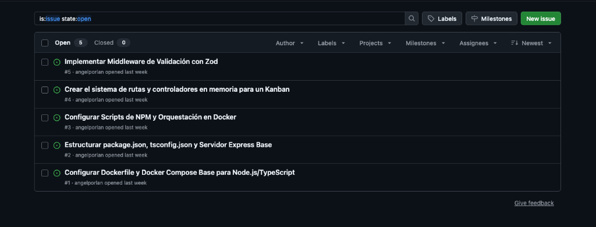

Hace unos días se empezó a hablar de una de las funciones más infravaloradas y potentes de Codex: la capacidad de gestionar sus propios hilos de conversación (threads) de forma autónoma.

Normalmente, si quieres que una IA trabaje en cinco tareas distintas a la vez, tienes que abrir cinco chats separados, pasar el contexto cinco veces y guiar cada uno de ellos a mano. Aburrido, lento e ineficiente.

La nueva actualización permite crear un "hilo coordinador" que actúa como un Project Manager: recibe los objetivos, abre hilos independientes para cada tarea, se comunica con ellos en paralelo, escribe el código y unifica el trabajo.

Decidí ponerlo a prueba con un reto real y agresivo: darle un repositorio de Git completamente vacío (solo con un README.md) y ordenarle que montara la arquitectura base de un backend containerizado en paralelo.

Esto fue lo que pasó.

## El Entorno y la Restricción: Pure-Docker

Para complicar más el experimento, añadí una restricción técnica clave en el prompt del hilo coordinador: cero instalaciones locales. No hay Node.js en la máquina host, todo el ciclo de vida del desarrollo debe estar pensado para ejecutarse e instalarse directamente dentro de contenedores de Docker.

La configuración requería aislar la identidad de Git de este proyecto personal de las credenciales globales del trabajo, usando perfiles separados para la herramienta de CLI de GitHub (gh) a través de variables de entorno, evitando cualquier tipo de colisión de accesos.

## Orquestando el Backlog en Paralelo


Le pasé un único prompt maestro al hilo coordinador con 5 requerimientos de nivel de producción para inicializar el proyecto:

* **Issue 1:** Configurar un Dockerfile (node:20-alpine) y un docker-compose.yml de desarrollo con volúmenes locales para permitir live-reload y volumen anónimo para node_modules.
* **Issue 2:** Estructurar estáticamente el package.json (Express, Zod, TypeScript, ts-node-dev) y crear el servidor base con un endpoint GET /health.
* **Issue 3:** Configurar los scripts de ejecución de NPM y la orquestación para que al tirar docker compose up el servidor TypeScript arranque de forma nativa dentro del contenedor.
* **Issue 4:** Diseñar la arquitectura limpia de carpetas (src/routes, src/controllers) y programar la lógica REST para las tarjetas de un tablero Kanban en un array en memoria.
* **Issue 5:** Implementar un middleware de validación estricto utilizando la librería Zod para asegurar que los estados de las tareas correspondan únicamente a las columnas "Todo", "In Progress" o "Done".

## La Magia del Git Worktree Concurrent

Al recibir la orden, el hilo coordinador ejecutó una serie de llamadas a la API de GitHub e inició 5 hilos secundarios duraderos de forma simultánea.

Para evitar conflictos de escritura en un repositorio que estaba vacío, la IA utilizó git worktree. En lugar de saltar de rama en rama en el mismo directorio, Codex clonó ramas independientes (codex-issue-*) en carpetas temporales aisladas en el disco duro.

> "El cuello de botella ya no es la velocidad de escritura del agente de IA; es la capacidad cognitiva del humano para supervisar el volumen de código que se está generando en paralelo."

En cuestión de un par de minutos, la barra lateral de la aplicación se convirtió en un centro de mando autónomo. Mientras el Hilo 1 terminaba la configuración de infraestructura de Docker, el Hilo 5 ya estaba subiendo a GitHub el middleware de validación en formato Draft Pull Request.

### Search results: 5 Open Issues



1. #1 Configurar un Dockerfile (node:20-alpine) y un docker-compose.yml de desarrollo con volúmenes locales para permitir live-reload y volumen anónimo para node_modules.
2. #2 Estructurar estáticamente el package.json (Express, Zod, TypeScript, ts-node-dev) y crear el servidor base con un endpoint GET /health.
3. #3 Configurar los scripts de ejecución de NPM y la orquestación para que al tirar docker compose up el servidor TypeScript arranque de forma nativa dentro del contenedor.
4. #4 Diseñar la arquitectura limpia de carpetas (src/routes, src/controllers) y programar la lógica REST para las tarjetas de un tablero Kanban en un array en memoria.
5. #5 Implementar un middleware de validación estricto utilizando la librería Zod para asegurar que los estados de las tareas correspondan únicamente a las columnas "Todo", "In Progress" o "Done".


### Pull requests list:
* [Draft] #7 Add task validation middleware - opened by angelporlan

## Fusión, Limpieza y Despliegue Local

Una vez que los sub-hilos finalizaron sus tareas y subieron sus respectivos Pull Requests, reentré al hilo coordinador y le ordené la fase de cierre: pasar los PRs a Ready for review, mergearlos todos en la rama principal (master), resolver las dependencias de archivos y eliminar los 5 worktrees locales para dejar el espacio de trabajo impecable.

El resultado final en local tras hacer un git pull fue un proyecto perfectamente estructurado que arrancó a la primera con un comando limpio:

```bash
docker compose up --build
```

El contenedor levantó la imagen alpina, ejecutó el npm install de manera interna y expuso el servidor TypeScript en el puerto 3000 con recarga en vivo activa. El endpoint GET /health devolviendo un 200 OK confirmó que una arquitectura multi-hilo autónoma puede levantar un proyecto desde la absoluta nada estructural.

## Lo que nos enseña este paradigma

A diferencia de los "sub-agentes" tradicionales (que realizan una llamada efímera a una función y desaparecen cuando el proceso principal termina), los hilos gestionados de Codex son duraderos. Si el Hilo 4 falla en la lógica de controladores del Kanban, puedes entrar directamente a esa ventana de chat específica, auditar el historial de mensajes de ese agente, iterar con él y corregirlo de forma aislada sin romper el flujo de los otros 4 hilos en ejecución.

Los costes en tokens se disparan exponencialmente al paralelizar agentes y es fácil golpear los rate limits de la API si escalas a 20 o 30 tareas concurrentes, pero como prueba de concepto para acelerar la inicialización de módulos, refactorizaciones masivas o cobertura de pruebas unitarias, la arquitectura de hilos coordinados ha dejado de ser el futuro: ya está aquí y funciona de verdad.

---

Si quieres más información sobre cómo lograr esto, puedes ver este [video de Owain Lewis](https://www.youtube.com/watch?v=WKG7VF7bL3I&t) donde entra en más detalle.

