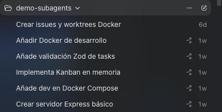

A few days ago, people started talking about one of the most underrated and powerful features of Codex: the ability to autonomously manage its own conversation threads.

Normally, if you want an AI to work on five different tasks at the same time, you have to open five separate chats, pass the context five times, and guide each of them manually. Boring, slow, and inefficient.

The new update allows creating a "coordinator thread" that acts as a Project Manager: it receives the objectives, opens independent threads for each task, communicates with them in parallel, writes the code, and unifies the work.

I decided to put it to the test with a real and aggressive challenge: giving it a completely empty Git repository (only with a README.md) and ordering it to build the base architecture of a containerized backend in parallel.

Here is what happened.

## The Environment and the Constraint: Pure-Docker

To complicate the experiment further, I added a key technical constraint in the coordinator thread prompt: zero local installations. No Node.js on the host machine; the entire development lifecycle must be designed to run and install directly inside Docker containers.

The configuration required isolating the Git identity of this personal project from global work credentials, using separate profiles for the GitHub CLI tool (gh) through environment variables, preventing any kind of credential collision.

## Orchestrating the Backlog in Parallel



I passed a single master prompt to the coordinator thread with 5 production-level requirements to initialize the project:

* **Issue 1:** Configure a Dockerfile (node:20-alpine) and a development docker-compose.yml with local volumes to allow live-reload and an anonymous volume for node_modules.
* **Issue 2:** Statically structure the package.json (Express, Zod, TypeScript, ts-node-dev) and create the base server with a GET /health endpoint.
* **Issue 3:** Configure NPM execution scripts and orchestration so that when running docker compose up the TypeScript server starts natively inside the container.
* **Issue 4:** Design the clean folder architecture (src/routes, src/controllers) and program the REST logic for a Kanban board's cards in an in-memory array.
* **Issue 5:** Implement a strict validation middleware using the Zod library to ensure that task states correspond only to the "Todo", "In Progress", or "Done" columns.

## The Magic of Concurrent Git Worktree

Upon receiving the order, the coordinator thread executed a series of GitHub API calls and started 5 long-running secondary threads simultaneously.

To avoid write conflicts in a repository that was empty, the AI used git worktree. Instead of jumping from branch to branch in the same directory, Codex cloned independent branches (codex-issue-*) into isolated temporary folders on the hard drive.

> "The bottleneck is no longer the writing speed of the AI agent; it is the cognitive capacity of the human to supervise the volume of code being generated in parallel."

In a matter of a couple of minutes, the application's sidebar became an autonomous command center. While Thread 1 was finishing the Docker infrastructure configuration, Thread 5 was already uploading the validation middleware to GitHub as a Draft Pull Request.

### Search results: 5 Open Issues


1. #1 Configure a Dockerfile (node:20-alpine) and a development docker-compose.yml with local volumes to allow live-reload and an anonymous volume for node_modules.
2. #2 Statically structure the package.json (Express, Zod, TypeScript, ts-node-dev) and create the base server with a GET /health endpoint.
3. #3 Configure NPM execution scripts and orchestration so that when running docker compose up the TypeScript server starts natively inside the container.
4. #4 Design the clean folder architecture (src/routes, src/controllers) and program the REST logic for a Kanban board's cards in an in-memory array.
5. #5 Implement a strict validation middleware using the Zod library to ensure that task states correspond only to the "Todo", "In Progress", or "Done" columns.


### Pull requests list:
* [Draft] #7 Add task validation middleware - opened by angelporlan

## Merging, Cleanup, and Local Deployment

Once the sub-threads completed their tasks and uploaded their respective Pull Requests, I re-entered the coordinator thread and ordered the closing phase: mark the PRs as Ready for review, merge them all into the main branch (master), resolve file dependencies, and delete the 5 local worktrees to leave the workspace spotless.

The final result locally after running a git pull was a perfectly structured project that started on the first try with a clean command:

```bash
docker compose up --build
```

The container spun up the alpine image, executed npm install internally, and exposed the TypeScript server on port 3000 with active live-reload. The GET /health endpoint returning a 200 OK confirmed that an autonomous multi-thread architecture can bootstrap a project from absolute structural nothingness.

## What this paradigm teaches us

Unlike traditional "sub-agents" (which make an ephemeral function call and disappear when the main process finishes), Codex's managed threads are persistent. If Thread 4 fails in the Kanban controllers logic, you can enter that specific chat window, audit that agent's message history, iterate with it, and fix it in isolation without breaking the flow of the other 4 threads running in parallel.

Token costs shoot up exponentially when parallelizing agents, and it's easy to hit API rate limits if you scale to 20 or 30 concurrent tasks, but as a proof of concept to accelerate module initialization, massive refactoring, or unit test coverage, the coordinator-thread architecture is no longer the future: it is already here and it actually works.

---

If you want more information on how to achieve this, check out this [video by Owain Lewis](https://www.youtube.com/watch?v=WKG7VF7bL3I&t) where he goes into more detail.

